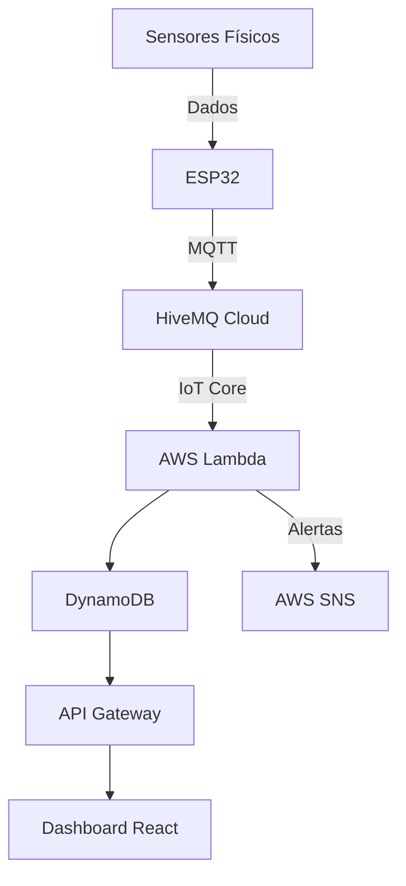

# Sistema de Monitoramento Ambiental Ciber-Físico


Projeto completo de um sistema ciber-físico que coleta dados ambientais (temperatura, umidade e qualidade do ar), processa na nuvem AWS e exibe em um dashboard em tempo real.

## 📷 Demonstração

Dashboard interativo com visualização de dados históricos e em tempo real

## 📂 Estrutura do Projeto

```tree
cyber-physical-system/
├── firmware/                  # Código para ESP32
│   ├── sensor_node/           # Sketch principal
│   └── libraries/             # Dependências
├── cloud-backend/             # Infraestrutura AWS
│   ├── terraform/             # Scripts de infra como código
│   ├── lambda_functions/      # Funções de processamento
│   └── mqtt_connector/        # Configuração do broker MQTT
├── dashboard-web/             # Aplicação React
│   ├── public/
│   ├── src/
│   │   ├── components/        # Componentes do dashboard
│   │   ├── services/          # Cliente API
│   │   └── App.js             # Ponto de entrada
│   └── package.json
├── hardware/                  # Esquemas elétricos
│   ├── circuit_diagram.png    # Diagrama de conexões
│   └── pcb_design/            # Arquivos de PCB
├── docs/                      # Documentação
│   ├── architecture.md        # Diagramas técnicos
│   └── hardware_setup.md      # Fotos da montagem
└── README.md                  # Este arquivo
```

## 🌐 Arquitetura do Sistema



## 🛠️ Hardware

### Componentes

| Componente |	Quantidade |	Descrição |
|------------|-------------|------------|
NodeMCU ESP32 |	1	| Microcontrolador WiFi
DHT11 |	1	| Sensor de temperatura/umidade
GP2Y1010AU0F |	1	| Sensor de partículas
Resistores 4.7kΩ |	1	| Pull-up para DHT11
Resistores 150Ω |	1	| Limitação de corrente LED
Capacitor 220μF |	1	| Filtro analógico

### Esquema Elétrico


## 💻 Firmware (ESP32)

### Pré-requisitos

- Arduino IDE 2.x
- Pacote ESP32 (usar Board Manager)
- Bibliotecas:
  - `DHT sensor library`
  - `PubSubClient`

### Configuração

```cpp
cpp

// Configurações WiFi
const char* ssid = "SEU_WIFI_SSID";
const char* password = "SUA_SENHA_WIFI";

// Configurações MQTT
const char* mqttServer = "broker.hivemq.com";
const int mqttPort = 1883;
const char* mqttTopic = "iot/sensor/data";
```

### Instalação

1. Conecte o ESP32 via USB
2. Abra `firmware/sensor_node/sensor_node.ino` na Arduino IDE
3. Selecione a placa: `NodeMCU-32S`
4. Faça upload do código

## ☁️ Implantação na AWS

### Pré-requisitos

- Conta AWS com free tier
- AWS CLI configurado
- Terraform v1.0+

### Passos de implantação

```bash
cd cloud-backend/terraform

# Inicializar ambiente Terraform
terraform init

# Planejar infraestrutura
terraform plan

# Aplicar configuração
terraform apply -auto-approve
```

### Serviços AWS utilizados

- **IoT Core:** Recebimento de mensagens MQTT
- **Lambda:** Processamento de dados em tempo real
- **DynamoDB:** Armazenamento de séries temporais
- **SNS:** Notificações por e-mail/SMS
- **API Gateway:** Interface para o dashboard

## 🌐 Dashboard Web

### Execução local

```bash
cd dashboard-web
npm install
npm start
```

### Configuração

Crie um arquivo `.env` na raiz do projeto com:

```env
REACT_APP_API_ENDPOINT=https://seu-api-gateway.amazonaws.com/prod
```

### Deploy no Vercel

https://vercel.com/button

## 🔍 Testando o Sistema

1. Alimente o circuito com USB ou bateria
2. Verifique conexão WiFi (LED azul do ESP32)
3. Monitore dados via Serial Monitor (115200 baud)
4. Acesse o dashboard: `http://localhost:3000` (local) ou seu domínio Vercel

## 📈 Melhorias Futuras

- Adicionar autenticação via AWS Cognito
- Implementar previsão com ML (SageMaker)
- Desenvolver app mobile (React Native)
- Adicionar monitoramento de CO₂

## 🤝 Contribuição

Contribuições são bem-vindas! Siga os passos:

1. Fork o projeto
2. Crie sua branch (`git checkout -b feature/nova-feature`)
3. Commit suas mudanças (`git commit -am 'Adiciona nova feature'`)
4. Push para a branch (`git push origin feature/nova-feature`)
5. Abra um Pull Request

## 📄 Licença

Distribuído sob a licença MIT. Veja LICENSE para mais informações.

**Desenvolvido por Jean-Pierre Reis** - [GitHub](https://github.com/Jean-Pierre-Reis) | [LinkedIn](https://www.linkedin.com/in/jean-pierre-reis-28310a81/)

Projeto para portfólio de sistemas ciber-físicos e IoT
