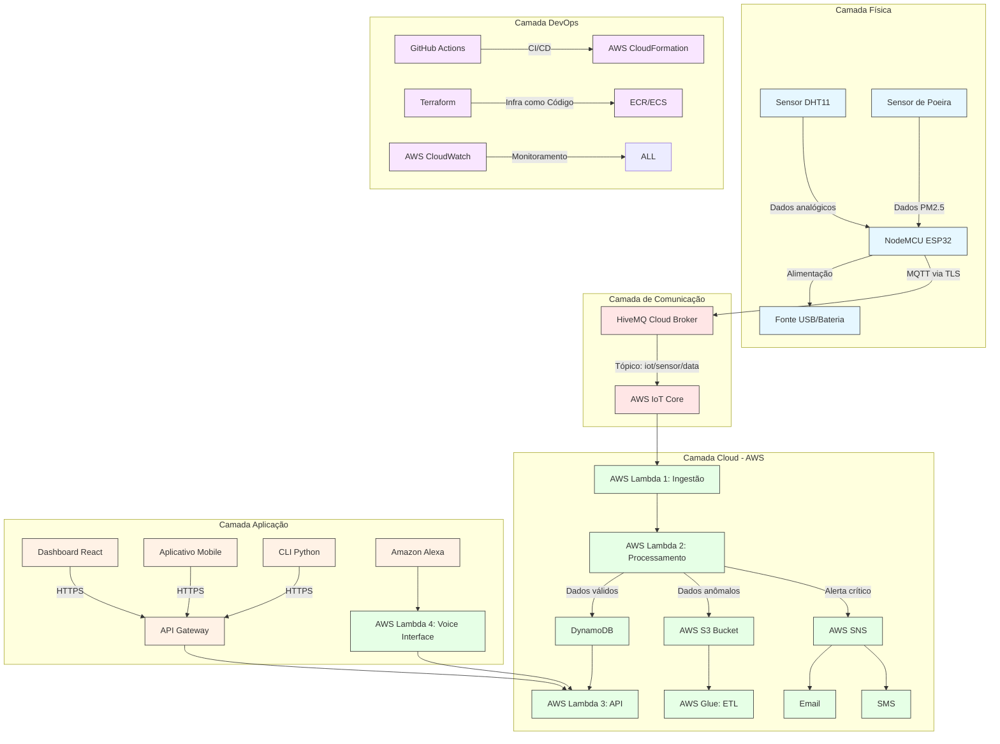
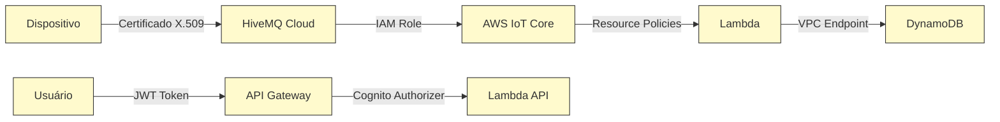

### Diagrama de Arquitetura Completo

Aqui está a arquitetura detalhada em camadas com componentes e fluxos de dados, seguindo padrões de mercado para sistemas ciber-físicos:


---

**Descrição Detalhada das Camadas**

#### 1. Camada de Física

| **Componente** | **Função** | **Especificações Técnicas** |
|-----------------|------------|-----------------------------|
NodeMCU ESP32 |	Microcontrolador principal	| WiFi 802.11 b/g/n, Bluetooth 4.2
Sensor DHT11	| Medição de temperatura e umidade	| Precisão: ±2°C, ±5% UR
Sensor de Poeira	| Detecção de partículas (PM2.5/PM10)	| Modelo: GP2Y1010AU0F
Fonte de Alimentação |	Energia para o sistema |	USB 5V ou Bateria Li-Po 3.7V

**Fluxo Físico:**

1. Sensores capturam dados ambientais a cada 15s
2. ESP32 faz pré-processamento (filtro média móvel)
3. Conversão A/D para dados analógicos

#### 2. Camada de Comunicação

| **Componente** |	**Protocolo** |	**Segurança** |	**Configuração** |
|----------------|----------------|---------------|------------------|
|HiveMQ Cloud	| MQTT 3.1.1 |	TLS 1.2 com autenticação X.509 |	QoS: 1 (At Least Once)|
|AWS IoT Core	| MQTT	| IAM Roles + Policies	| Rule: "SELECT * FROM 'iot/sensor/#'"|

**Fluxo de Comunicação:**

`ESP32 → (WiFi) → Router → [TLS 8883] → HiveMQ Cloud → [TLS 443] → AWS IoT Core`

#### 3. Camada Cloud - AWS (Processamento)

| **Serviço AWS** |	**Função** |	**Configuração Chave** |
|-----------------|------------|-------------------------|
|Lambda 1 (Ingestão) |	Validação inicial de payload |	Runtime: Python 3.9, Timeout: 3s|
|Lambda 2 (Processamento)|	Business logic: - Validação de limites - Detecção de anomalias - Geração de alertas |	Memória: 128MB, VPC: Não
|DynamoDB |	Armazenamento de dados válidos |	PK: device_id, SK: timestamp|
|S3 Bucket |	Data Lake para dados anômalos |	Formato: Parquet, Partição: ano/mês/dia|
|SNS |	Notificações em tempo real |	Tópicos: CriticalAlerts, WarningAlerts|

**Fluxo de Processamento:**

```python
def lambda_handler(event, context):
    if validate_payload(event):
        if check_anomalies(event):
            save_to_s3(event)  # Dados suspeitos
        else:
            process_data(event)  # Dados válidos
            if event['temp'] > 30:
                trigger_alert(event)  # Notificação
            save_to_dynamodb(event)
```

#### 4. Camada de Aplicação

| **Componente** |	**Tecnologias** |	**Função** |
|----------------|------------------|------------|
Dashboard React	| React 18, Chart.js, Material-UI	| Visualização em tempo real
API Gateway	| REST API, Authorizer: AWS Cognito	| Throttling: 1000 req/s
Lambda 3 (API)	| Consulta DynamoDB + Cache Redis	| Query: Last 24h data
Alexa Skill	| Voice UX: "Qual a temperatura atual?"	| Conversão texto-voz

**Endpoint Exemplo:**

```
GET https://api.example.com/data?device_id=ESP32-001&hours=24
Response: { "temp": [25.3, 26.1, ...], "timestamps": [...] }
```

#### 5. Camada DevOps

| **Ferramenta** |	**Função** |
|----------------|-------------|
|Terraform	|Provisionamento de: VPC, Lambdas, DynamoDB, IAM Roles
|GitHub Actions	|CI/CD: <br> - Teste firmware (PlatformIO) <br> - Deploy infra <br> - Deploy frontend|
|CloudWatch	|Monitoramento: <br> - Latência MQTT <br> - Erros Lambdas <br> - Uso de memória|
|Sentry	|Error tracking no frontend|

#### Pipeline CI/CD:

```yaml
name: Deployment
on: [push]
jobs:
  deploy-infra:
    runs-on: ubuntu-latest
    steps:
      - uses: actions/checkout@v3
      - run: terraform init -backend-config=prod.hcl
      - run: terraform apply -auto-approve
```

#### Diagrama de Segurança



#### Políticas de Segurança:

1. Dispositivo: Autenticação mutual TLS (mTLS)
2. Cloud: IAM Roles com política de mínimo privilégio
3. Aplicação:
    - JWT Tokens com expiração de 1h
    - CORS restrito ao domínio do dashboard
5. Dados:
    - Criptografia em repouso (AWS KMS)
    - Masking de dados sensíveis no frontend
