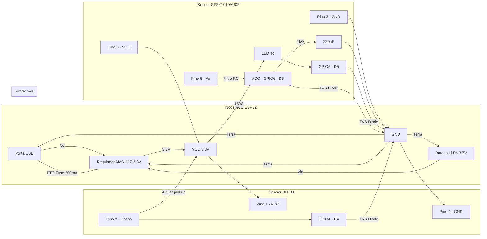

### Esquema Elétrico Detalhado para o Dispositivo IoT

Aqui está o esquema completo para conectar os sensores ao NodeMCU ESP32, incluindo proteções e otimizações energéticas:



### Lista de Componentes

| **Componente** |	**Especificações** |	**Quantidade** |	**Função** |
|----------------|---------------------|-----------------|-------------|
NodeMCU | ESP32	ESP-WROOM-32 |	1	| Microcontrolador
DHT11	| Temperatura/Umidade |	1 | Sensor ambiental
GP2Y1010AU0F	| Poeira PM2.5 |	1	| Sensor de partículas
Resistor |	150Ω 1/4W |	1	| Limitação corrente LED IR
Resistor |	4.7kΩ 1/4W |	1	| Pull-up DHT11
Resistor |	1kΩ 1/4W |	1	| Pull-down ADC
Capacitor |	220μF 16V |	1	| Filtro ruído analógico
Diodo TVS |	SMAJ5.0A |	1	| Proteção contra surtos
Fuse PTC |	500mA |	1	| Proteção USB
Bateria |	Li-Po 3.7V 1000mAh |	1	| Backup energia

### Detalhamento das Conexões

**Sensor DHT11 (Temperatura/Umidade)**

| **Pino DHT11** |	**Conexão ESP32** |	**Notas** |
|----------------|--------------------|-----------|
1 (VCC)	| 3.3V	| Alimentação
2 (Dados)	| GPIO4 (D4)	| Com resistor pull-up 4.7kΩ
4 (GND)	| GND	| Terra

**Circuito Proteção:**

Diodo TVS entre dados e GND
Capacitor 100nF próximo ao VCC

**Sensor GP2Y1010AU0F (Poeira)**

| **Pino Sensor** |	**Conexão ESP32** |	**Notas** |
1 (LED-)	| GPIO5 (D5)	| Com resistor 150Ω em série
3 (GND)	| GND	| Terra comum
5 (VCC)	| 3.3V	| Alimentação
6 (Vo)	| GPIO6 (D6)	| Com filtro RC (1kΩ + 220μF)

**Filtro RC:**

```plaintext
Vo ---[1kΩ]--- ADC
      |
     === 220μF
      |
     GND
```

**Alimentação e Gerenciamento Energético**

1. **Fonte Primária:** USB 5V
2. **Backup:** Bateria Li-Po 3.7V com circuito de carga integrado no ESP32
3. **Regulador:** AMS1117-3.3V (já integrado na NodeMCU)
4. **Proteções:**
    - Fuse PTC 500mA na entrada USB
    - Diodos de proteção em todos os GPIOs
    - Capacitor 100μF no VIN

**Diagrama Físico (Layout Sugerido)**

```plaintext
  [USB] 
    |
  [PTC Fuse]
    |
  [AMS1117]---[100μF]---[GND]
    |    |
    |   [BAT+] 
    |    |
  3.3V--+-------------------+-----------------+
        |                   |                 |
        |                 [150Ω]           [4.7kΩ]
        |                   |                 |
        |                  [LED IR]         [DHT11]
        |              (GP2Y1010)             |
        |                   |                 |
        |              [1kΩ]-[220μF]-GND   GPIO4
        |                   |             
      GPIO5                Vo---[1kΩ]---ADC (GPIO6)
        |                   |
        |              [GND Sensor]
        |
  [TVS Diodes]-GND
```

### Especificações Técnicas Críticas

1. **Consumo Energético:**
    - Modo ativo: 120mA
    - Deep Sleep: 10μA
    - LED IR: 20mA (pulsado)
2. **Resolução ADC:**
    - 12 bits (0-4095) para leitura analógica
    - Tensão referência: 3.3V
3. **Fórmula Calibração Poeira:**
```cpp
float voltage = analogRead(A0) * (3.3 / 4095.0);
float dust = (voltage - 0.6) * (1000 / 0.6); // μg/m³ (para 3.3V)
```

4. **Sequência de Leitura:**
1. Ativar LED IR (GPIO5 LOW)
2. Aguardar 280μs
3. Ler ADC (GPIO6)
4. Desativar LED IR (GPIO5 HIGH)
5. Aguardar 9680μs entre leituras

### Código de Inicialização

```cpp
#include <DHT.h>

#define DHTPIN 4
#define DUST_LED 5
#define DUST_ADC 6

DHT dht(DHTPIN, DHT11);

void setup() {
  pinMode(DUST_LED, OUTPUT);
  digitalWrite(DUST_LED, HIGH); // LED off
  dht.begin();
  
  // Configuração ADC
  analogReadResolution(12);
  analogSetAttenuation(ADC_11db); // Full range 0-3.3V
}

void loop() {
  // Leitura DHT11
  float temp = dht.readTemperature();
  float humidity = dht.readHumidity();
  
  // Leitura GP2Y1010
  digitalWrite(DUST_LED, LOW);
  delayMicroseconds(280);
  int rawDust = analogRead(DUST_ADC);
  digitalWrite(DUST_LED, HIGH);
  
  // Processamento...
}
```

### Recomendações de Montagem

1. Use **protoboard** para testes ou **PCB customizado** para versão final
2. **Isolamento** entre circuitos digitais e analógicos
3. **Filtro EMI** na alimentação USB
4. **Gabinete** com entradas de ar para sensores
5. **Calibração** dos sensores com valores de referência
